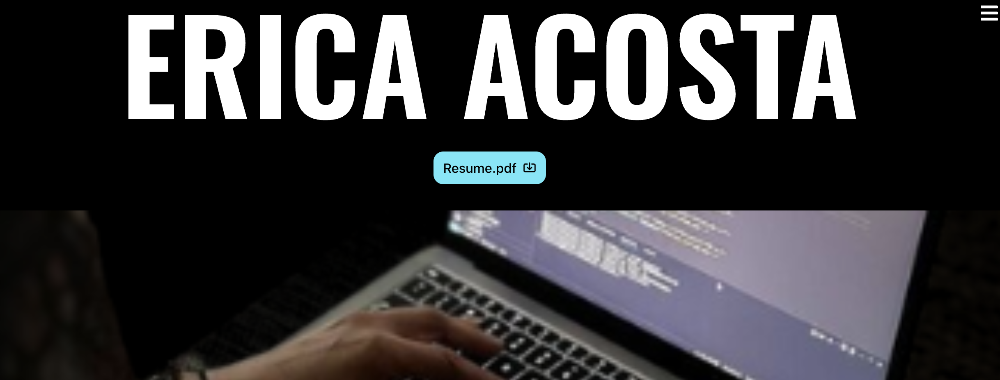
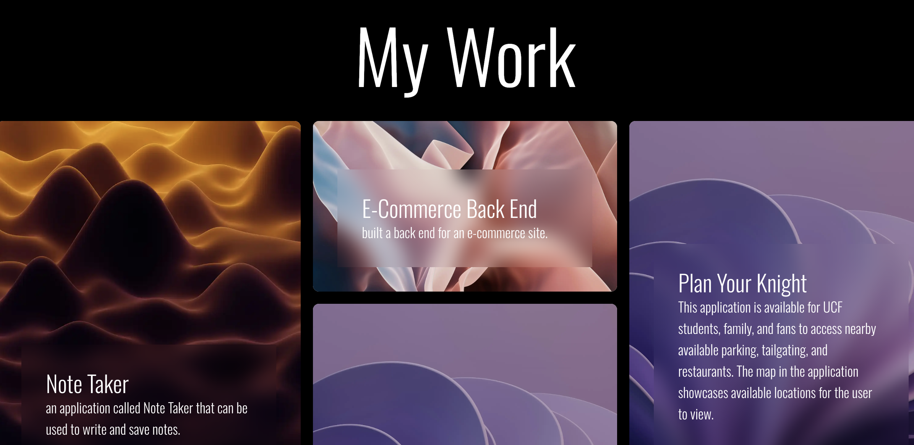

# React Portfolio

   
## Description
created a portfolio using my new React skills to easily share my current projects.

## Table of Contents
- [Installation](#installation)
- [Usage](#usage)
- [License](#license)
- [Questions](#questions)

## Installation 
Clone the code from the GitHub repository and then run npm install in the terminal.
    
## Usage 
Run npm run dev in the terminal and connect to `localhost:5173` and click the link in the console to view web browser. 

## License 
MIT
https://opensource.org/licenses/MIT

## Questions
    
My GitHub is [ejacosta86](https://github.com/ejacosta86).
If you have any further questions, you can email me at ejacosta86@gmail.com.

## GitHub Repo
click link to view [Repo](https://github.com/Ejacosta86/React-Portfolio).

## web link
click link to view [website](https://ericaacostadev.netlify.app/).

## Preview

